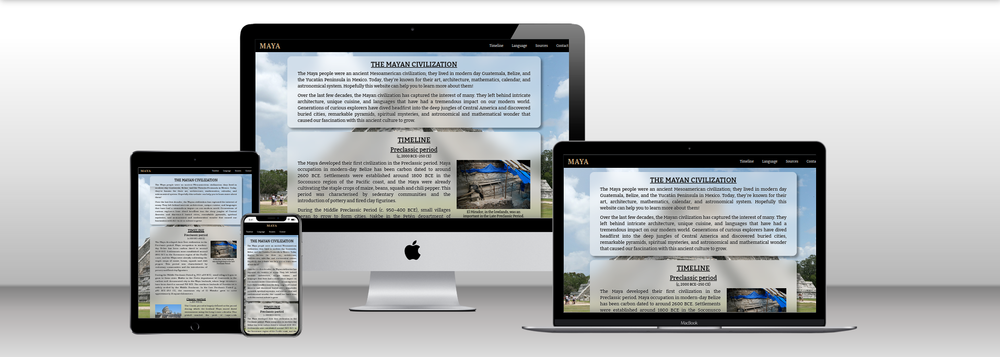
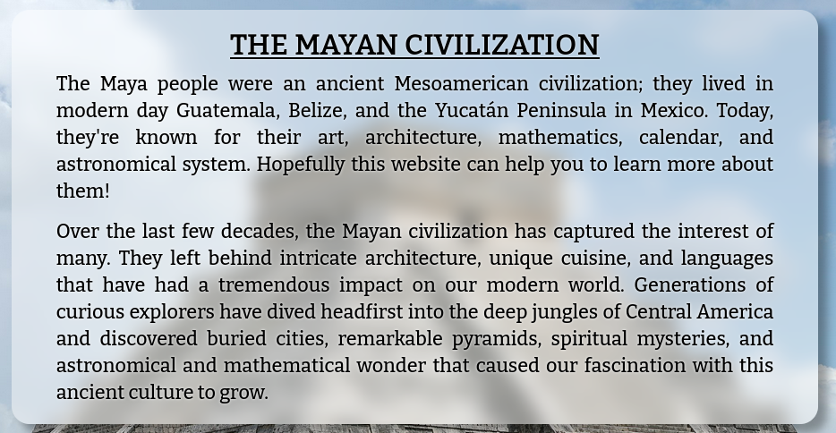
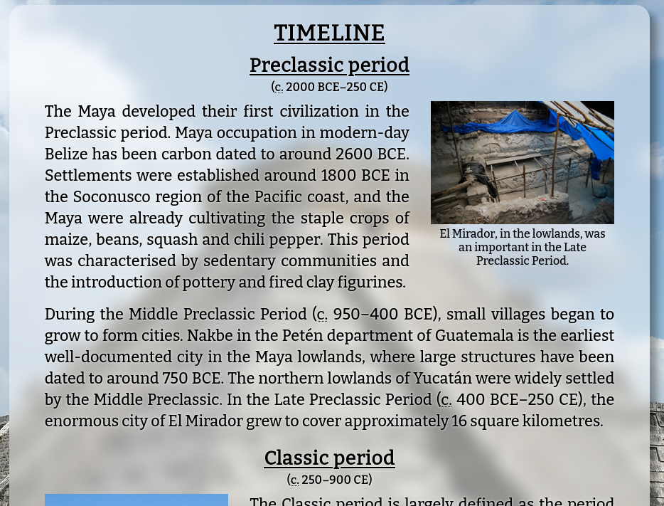
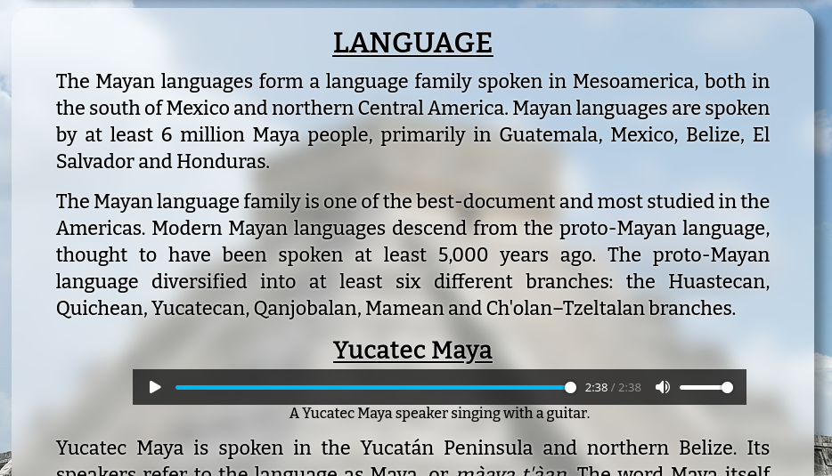
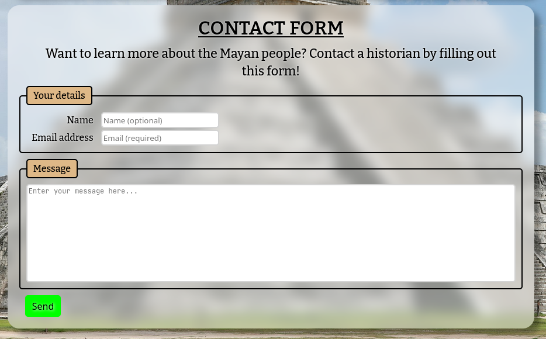

# The Mayan civilization

This website teaches the reader all about the history of the ancient Mayan civilization. It's targeted towards those with a keen interest in learning about history and people.

## Features

- __Layout__
    - The entire site has a background image of El Castillo, a large and well-known monument made by the Mayans.
    - Each section of the page is semi-transparent, blurring the background image as well as casting a slight shadow on it.
    - The text in each section has a slight white glow, which makes it stand out a little more.

- __Navigation bar__
    - The responsive navigation bar allows the user to jump directly to each section of the page.

- __Introduction__
    - The introduction section tells the user what to expect when reading through the site's content.
    - It also serves to grab the user's attention in the hope that they feel interested enough to continue reading.

- __Timeline section__
    - The timeline section gives a detailed description of each major period of the Maya civilization's history.
    - This section also has relevant pictures for each period to give the user a better idea of how this civilization would have looked.

- __Language section__
    - The language section explains to the user some information about the Mayan language family, as well as how many people speak these languages today.
    - This section also contains an audio recording of a Mayan person singing a song and speaking in one of the Mayan languages.

- __Sources section__
    - The sources section contains links to the sources used in gathering the information that the site contains.
    - The user can click these to open them in a new tab if they want to learn more.

- __Contact form__
    - The contact form allows the user to get in correspondence with a historian who knows more about the Mayan civilization.
    - The user must input their email and a message, and can optionally include their name.

### Features left to implement

- Sticky navigation bar
- A quiz on the information given to make it more fun for the user
- Examples of the Maya script, and translations from English into Yucatec Maya
- More animations, for example animating the underline on each link to expand out from the center
- Center the navigation bar below the site logo when the screen is less than 600px wide

## Testing

As I added features to this site, I made sure to make the page responsive on different screen sizes.
If the user is looking at the site on a phone, the navigation bar will appear under the site logo, instead of to the right of it.
When I first added this feature, the site logo's link extended all the way across the header, and its padding stuck out on the right. I fixed this by switching the order of the `<h1>` and `<a>` tags used for the logo.

In addition, the pictures in the timeline section will be placed between paragraphs, to make the page flow more naturally.
This was a slight challenge for me, but after searching for solutions to my problem I found [this post](https://stackoverflow.com/questions/32559744/using-media-query-and-show-a-div-below-another-div-which-is-written-before) which helped me figure it out.

### Validator testing

- HTML
    - No errors were returned when passing through the official [W3C validator](https://validator.w3.org/nu/?doc=https%3A%2F%2Ftetraxile-ci.github.io%2Fpp1%2F)
- CSS
    - No errors were returned when passing through the official [(Jigsaw) validator](https://jigsaw.w3.org/css-validator/validator?uri=https%3A%2F%2Ftetraxile-ci.github.io%2Fpp1%2F&profile=css3svg&usermedium=all&warning=1&vextwarning=&lang=en)

### Unfixed bugs

- In the contact form, the labels for the name and email fields will end up above their respective entry fields if the screen is less than 430px wide. 

## Deployment

- The site was deployed to GitHub Pages. The steps to deploy are as follows:
    - In the GitHub repository, navigate to the Settings tab
    - In the Pages section, select the `main` branch and click "Save"
    - Once this branch has been selected, the site will be deployed within a few minutes.

## Credits

### Content

- The text in the intro section was edited from [this website](https://www.historyonthenet.com/mayans-overview-civilization).
- The text in the timeline and language sections was edited from [Wikipedia - Maya civilization](https://en.wikipedia.org/wiki/Maya_civilization), [Wikipedia - Mayan languages](https://en.wikipedia.org/wiki/Mayan_languages) and [Wikipedia - Yucatec Maya language](https://en.wikipedia.org/wiki/Yucatec_Maya_language).
- The Wikipedia logo in the sources section was taken from [Font Awesome](https://fontawesome.com/).
- Various websites helped me figure out how to implement particular features, these are mentioned in comments at the relevant locations.

### Media

- The images used on the timeline section and for the background of the site were taken from [Wikimedia Commons](https://commons.wikimedia.org).
- The audio recording in the language section was extracted from [this video](https://commons.wikimedia.org/wiki/File:WIKITONGUES-_Manuel_speaking_Yucatecan.webm) on Wikimedia Commons.
